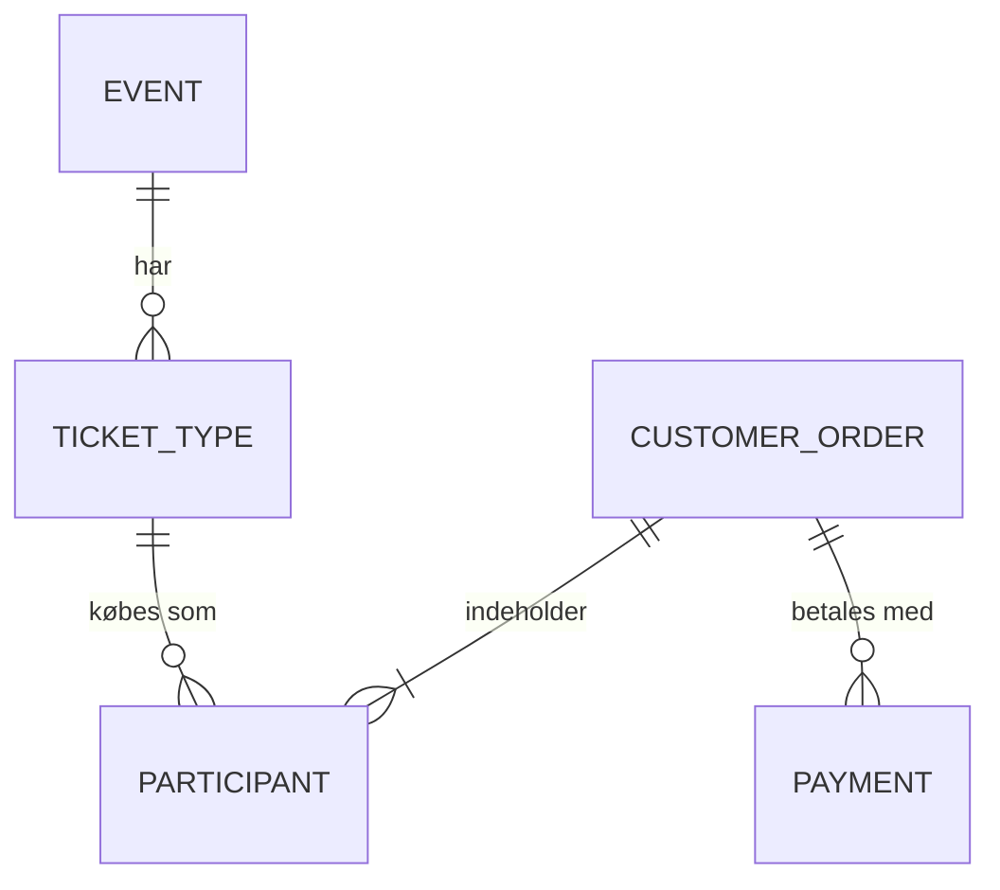

# Billetsystem til en hobbymesse

Billetbestilling og adminsystem til en hobbymesse, bygget med Java (Spring Boot) og PostgreSQL.

> **Status: under udvikling.** Backend-grundlaget (database, billettyper og bestilling) er på plads. Adminside, betaling og bestillingsside er endnu ikke lavet. Se [roadmap](#roadmap).
>
> Dette er et hobbyprojekt.

## Baggrund

I dag bestiller man billet til messen ved at sende en mail, får et kontonummer tilbage og betaler med bankoverførsel. Det giver meget manuelt arbejde for arrangørerne. Projektet skal erstatte det med:

- en bestillingsside, hvor man vælger billetter og betaler med kort eller MobilePay
- en adminside, hvor arrangørerne kan se deltagerlisten, antal solgte billetter og styre priser (fx early bird)

## Teknologi

| Lag | Valg |
|---|---|
| Backend | Java 21, Spring Boot 3.5 (Spring Web, Spring Data JPA, Bean Validation) |
| Database | PostgreSQL |
| Frontend | HTML og JavaScript (planlagt) |
| Betaling | Stripe Checkout med kort og MobilePay (planlagt) |

## Hvad der virker nu

- Billettyper med pris og gyldighedsperiode, så fx early bird skifter automatisk til normalpris på en bestemt dato
- `GET /api/ticket-types/current` viser de billetter, der kan købes lige nu
- `POST /api/orders` opretter en bestilling med flere deltagere. Prisen beregnes på serveren, og inputtet valideres
- Samlet fejlformat, så frontenden altid får læselige fejlbeskeder

## Datamodel



| Tabel | Indhold |
|---|---|
| `event` | Selve messen (navn, datoer, evt. max antal deltagere) |
| `ticket_type` | Billettyper med pris i øre og gyldighedsperiode |
| `customer_order` | En bestilling med kontaktperson, status (`PENDING`, `PAID`, `CANCELLED`, `REFUNDED`) og samlet beløb |
| `participant` | Én række pr. billet med deltagerens fulde navn og den pris, der blev betalt |
| `payment` | Betalinger fra Stripe (oprettet i databasen, endnu ikke brugt af koden) |
| `admin_user` | Logins til adminsiden (oprettet i databasen, endnu ikke brugt af koden) |

Der er også et view, `v_ticket_sales`, som giver antal solgte billetter og indtægt pr. billettype. Det tæller kun betalte bestillinger.

## Designvalg

- **Prisen findes kun på serveren.** Frontenden sender aldrig en pris, så ingen kan ændre den. Serveren slår prisen op ud fra, hvilken billettype der gælder på bestillingstidspunktet.
- **Beløb gemmes i øre** som heltal (29500 = 295,00 kr.), så der ikke opstår afrundingsfejl.
- **Prisen kopieres til hver deltager**, så historikken stemmer, selv hvis billetprisen ændres senere.
- **En bestilling bliver først betalt, når Stripe bekræfter det** (planlagt), ikke fordi brugeren lander på en tak-side.
- **Databasen styres af `database/schema.sql`.** Hibernate kontrollerer kun ved opstart, at Java-klasserne passer til tabellerne (`ddl-auto=validate`).
- **Hemmeligheder ligger ikke i koden.** Databasekodeordet læses fra miljøvariablen `DB_PASSWORD`.

## Kom i gang

### Krav

- Java 21 eller nyere
- PostgreSQL (testet med version 16)
- IntelliJ IDEA, eller Maven hvis du kører fra terminalen

### 1. Opret databasen

```sql
CREATE DATABASE billetsystem;
```

Kør derefter `database/schema.sql` i databasen, fx i pgAdmin (Query Tool) eller med
`psql -d billetsystem -f database/schema.sql`.

> **Advarsel:** filen starter med `DROP TABLE`, så den nulstiller alle tabeller. Brug den kun på en tom eller ny database. Den indeholder også eksempeldata (en messe og to billettyper), som du bør tilpasse.

### 2. Opret en databasebruger til projektet

Skift `SkrivEtKodeordHer` ud med et kodeord, du selv vælger:

```sql
CREATE USER billetsystem WITH PASSWORD 'SkrivEtKodeordHer';
GRANT CONNECT ON DATABASE billetsystem TO billetsystem;
GRANT USAGE ON SCHEMA public TO billetsystem;
GRANT SELECT, INSERT, UPDATE, DELETE ON ALL TABLES IN SCHEMA public TO billetsystem;
GRANT USAGE, SELECT ON ALL SEQUENCES IN SCHEMA public TO billetsystem;
ALTER DEFAULT PRIVILEGES IN SCHEMA public GRANT SELECT, INSERT, UPDATE, DELETE ON TABLES TO billetsystem;
ALTER DEFAULT PRIVILEGES IN SCHEMA public GRANT USAGE, SELECT ON SEQUENCES TO billetsystem;
```

Vil du bruge en anden bruger, så ret `spring.datasource.username` i `src/main/resources/application.properties`.

### 3. Start programmet

Sæt miljøvariablen `DB_PASSWORD` til kodeordet fra trin 2 og start programmet.

- **IntelliJ:** åbn `BilletsystemApplication`, vælg **Run → Edit Configurations → Modify options → Environment variables**, skriv `DB_PASSWORD=dit-kodeord`, og kør.
- **Terminal:** `DB_PASSWORD=dit-kodeord mvn spring-boot:run`

Programmet kører på **http://localhost:8081**. Porten kan ændres med `server.port` i `application.properties`.

### 4. Prøv det af

Filen `http/requests.http` indeholder færdige forespørgsler, som du kan køre direkte fra IntelliJ. Du kan også bruge `curl`:

```bash
# Hent billettyper, der kan købes nu
curl http://localhost:8081/api/ticket-types/current

# Opret en bestilling
curl -X POST http://localhost:8081/api/orders \
  -H "Content-Type: application/json" \
  -d '{
        "contactName": "Test Testesen",
        "email": "test@example.com",
        "participants": [
          { "fullName": "Anna Andersen", "ticketTypeId": 2 }
        ]
      }'
```

## API

### `GET /api/ticket-types/current`

Returnerer de billettyper, der kan købes lige nu (slået til, startet og ikke udløbet), billigste først.

```json
[
  {
    "id": 2,
    "eventName": "Hobbymesse april 2027",
    "name": "Standard",
    "priceOre": 29500,
    "validFrom": "2026-10-07T22:00:00Z",
    "validTo": null
  }
]
```

### `POST /api/orders`

Opretter en bestilling med status `PENDING`. Svarer med `201 Created`.

| Felt | Krav |
|---|---|
| `contactName` | påkrævet, maks. 150 tegn |
| `email` | påkrævet, skal ligne en e-mail |
| `phone` | valgfri, maks. 30 tegn |
| `note` | valgfri |
| `participants` | 1 til 20 deltagere, hver med `fullName` (påkrævet) og `ticketTypeId` (påkrævet) |

Er input ugyldigt, svarer serveren med `400` og en forklaring, fx `{"fejl": "Ugyldige data", "felter": {...}}`. Bestiller man en billettype, der ikke kan købes lige nu (fx en udløbet early bird), får man også `400`.

## Projektstruktur

```
billetsystem/
├─ database/
│  └─ schema.sql                 databaseskema, view og eksempeldata
├─ http/
│  └─ requests.http              færdige testforespørgsler til IntelliJ
├─ pom.xml
└─ src/main/
   ├─ java/dk/billetsystem/
   │  ├─ BilletsystemApplication.java
   │  ├─ model/                  JPA-klasser (Event, TicketType, CustomerOrder, Participant)
   │  ├─ repository/             opslag i databasen (Spring Data JPA)
   │  ├─ service/                forretningsregler (TicketService, OrderService)
   │  ├─ controller/             REST-API og fejlhåndtering
   │  └─ dto/                    objekter til ind- og udgående JSON
   └─ resources/
      └─ application.properties
```

## Roadmap

- [x] Databaseskema i PostgreSQL
- [x] Hent billettyper, der kan købes nu
- [x] Opret bestilling med serverberegnet pris og validering
- [ ] Adminlogin (Spring Security)
- [ ] Deltagerliste, salgstal og eksport til CSV
- [ ] Administration af billettyper og early bird-perioder
- [ ] Betaling med Stripe (kort og MobilePay)
- [ ] Bestillingsside i HTML og JavaScript
- [ ] Bekræftelsesmail
- [ ] Bordreservation (inkl. begynderbord) og gæstebilletter
